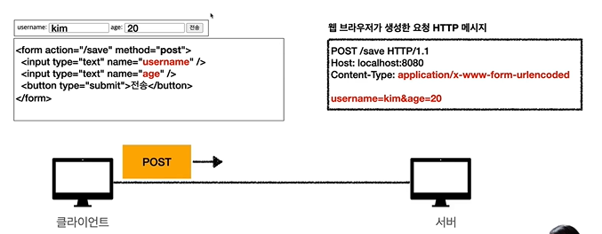
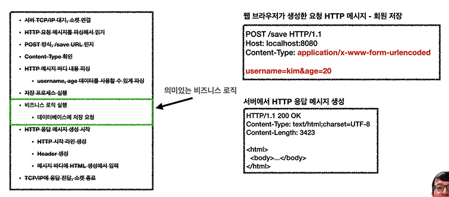
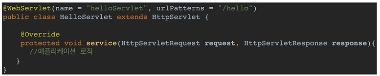
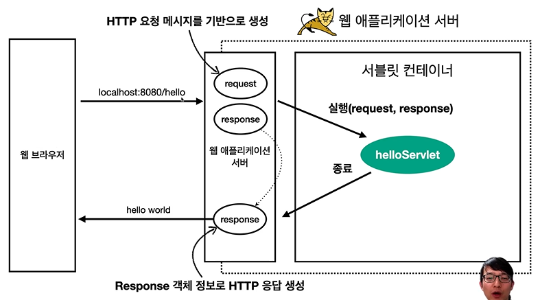
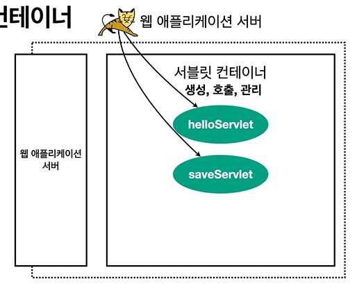

## HTML Form 데이터 전송

> POST전송 - 저장
> 

- post로 보내면 보통 저런 Content-Type으로 보내짐
- 이 HTTP메세지가 server로 전송됨

 

## 서버에서 처리해야 하는 업무
> 웹 애플리케이션 서버 직접 구현
> 

                                                                                        

- HTTP 요청 메세지는 단순 text, 잘라서 읽는 파싱 작업
  
 

> 서블릿을 지원하는 WAS 사용
>

- 초록색을 제외한 모든 것을 지원

 

---
 

## 서블릿

> 특징
> 

- 웹브라우저에서 서버로 URL 호출이 왔을 때
즉, urlPatterns(/hello)의 URL이 호출되면 서블릿 코드가 실행
- HTTP 요청 정보를 편리하게 사용할 수 있는 HttpServletRequest
- HTTP 응답 정보를 편리하게 제공할 수 있는 HttpServletResponse
- 개발자는 HTTP 스펙을 매우 편리하게 사용
  
 

> 전체 구조
> 

- 웹브라우저에서 요청이 오면,
WAS서버에서 request, response객체를 생성
- request, response객체를 Parameter로 넘기면서 helloServlet실행
  
 

> HTTP 요청시
> 
- WAS는 Request, Response객체를 새로 만들어서 서블릿 객체 호출
- 개발자는 Request객체에서 HTTP 요청 정보를 편리하게 꺼내서 사용
- 개발자는 Response객체에 HTTP 응답 정보를 편리하게 입력
- WAS는 Response객체에 담겨 있는 내용으로 HTTP 응답 정보를 생성

 

---
 

## 서블릿 컨테이너

<aside>
💡 톰캣처럼 서블릿을 지원하는 WAS 안에는 
서블릿 컨테이너가 있다.

</aside>

- 서블릿 컨테이너는 서블릿객체를 생성, 호출, 관리(생명주기, WAS종료할때, 같이 종료)
- 서블릿 객체는 **싱글톤으로 관리**
    - 고객이 요청이 올 때 마다 계속 객체(ex) helloServlet, saveServlet)를 생성하는 것은 비효율
        
        ⚠️ request, response는 요청이 올 때마다 새로 생김
        
    - 최초 로딩 시점에 서블릿 객체를 미리 만들어두고 재활용
    - 모든 고객 요청은 동일한 서블릿 객체 인스턴스에 접근
    - 공유 변수 사용 주의
    - 서블릿 컨테이너 종료시 함께 종료
- JSP도 서블릿으로 변환 되어서 사용
- 동시 요청을 위한 멀티 쓰레드 처리 지원